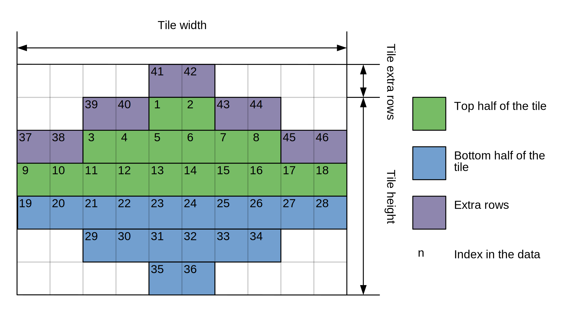

###################
Sprite Image (.pl8)
###################

.pl8 files are basically bitmaps, with some additional features bolted on.
There are multiple images (sprites) within one file. The height, width, 
and data offset are located in the header.

The color table is stored in a separate file.

A type of "transparency" is supported, despite the color table not supporting
an alpha channel. 

The image data is located at the 'Data Offset', and is Width x Height long.
Each byte corresponds to a color in the color table (.256 file).

+--------------+-------------------------------------------------------------------------+
| File Offset  |                                                                         |
| (bytes)      |                                                                         |
+==============+=========================================================================+
| 0 - 1        | 0bit indicates RLS encoding, the rest is unknown                        |
+--------------+-------------------------------------------------------------------------+
| 2 - 3        | Number of Sprites                                                       |
+--------------+-------------------------------------------------------------------------+
| 4 - 7        | Unknown                                                                 |
+--------------+-------------------------------------------------------------------------+
|              | Sprite 1                                                                |
+--------------+-------------------------------------------------------------------------+
| 8 - 9        | Width                                                                   |
+--------------+-------------------------------------------------------------------------+
| 10 - 12      | Height                                                                  |
+--------------+-------------------------------------------------------------------------+
| 13 - 16      | Data Offset                                                             |
+--------------+-------------------------------------------------------------------------+
| 17 - 18      | x coordinate                                                            |
+--------------+-------------------------------------------------------------------------+
| 20 - 21      | y coordinate                                                            |
+--------------+-------------------------------------------------------------------------+
| 22           | Tile type                                                               |
|              |   * 0 - simple bitmap like encoding                                     |
|              |   * 1 - isometric (ISO) encoding                                        |
|              |   * 2 - ISO encoding with additional rows                               |
|              |   * 3 - ISO encoding additional rows on the left side only              |
|              |   * 4 - ISO encoding additional rows on the right side only             |
+--------------+-------------------------------------------------------------------------+
| 23           | Indicates how many extra row is stored in ISO encoded tile              |
+--------------+-------------------------------------------------------------------------+
| 24 - 25      | Unknown                                                                 |
+--------------+-------------------------------------------------------------------------+
|              | Sprite 2                                                                |
+--------------+-------------------------------------------------------------------------+

Simple bitmap like encoding
---------------------------

Each byte from given offset, is simply index to pallet and no more
manipulation is needed. Just take data from `tile.offset` until
`tile.offset + tile.width * tile.height`

Run-length encoding (RLE)
-------------------------

RLE uses small chunks to encode number of multiple consequent
transparent or number of consequent opaque pixels.

Firs byte in each chunk indicates how many opaque pixels is in this
chunk. If the number of opaque pixels is zero, next byte indicates how
many transparent pixels should be filed in the image.

+--------------+-------------------------------------------------+
| File Offset  | Color                                           |
| (bytes)      |                                                 |
+==============+=================================================+
| 1            | Number of opaque pixels                         |
+--------------+-------------------------------------------------+
| 2            | Number of transparent pixels or index to pallet |
+--------------+-------------------------------------------------+
| 3-N          | Indices to pallet                               |
+--------------+-------------------------------------------------+

Isometric encoding (ISO)
------------------------

Isometric images are stored by rows. Each row is centred and it's width
is dependant on the Y position.

Row width can be calculated this way:

.. code-block:: cpp

    row_width = y < half_heing ? (y * 4) + 2 : (height - half_heing) * 5 + 2;

Then there are additional rows. They add additional row on the top of
the image, but they are stored diagonally from the middle of left side
to the middle of top side and from the middle of top to to middle of the
right side. See following image for better understanding.

Based on `Tile type` the extra rows can be on left side, right or on
both sides.

Iso tile in its entirety can be parsed with code similar to this:

.. code-block:: cpp

    std::ifstrem file;

    ...

    file.seekg(tileHeader->offset);

    // Fill top half
    for (int y = 0; y < halfHeight; ++y)
    {
        int rowStart = (halfHeight - 1 - y) * 2;
        int rowStop = rowStart + (y * 4) + 2;

        for (int x = rowStart; x < rowStop; ++x)
        {
            uint8_t palletIndex = file.get();
            tile.pixels[((y + tileHeader->extraRows) * tileHeader->width) + x] = palletIndex;
        }
    }
    // Fill bottom half
    for (int y = halfHeight; y < tileHeader->height; ++y)
    {
        int rowStart = (halfHeight - 1 - (tileHeader->height - y - 1)) * 2;
        int rowStop = rowStart + ((tileHeader->height - y -1) * 4) + 2;

        for (int x = rowStart; x < rowStop; ++x)
        {
            uint8_t palletIndex = file.get();
            tile.pixels[((y + tileHeader->extraRows) * tileHeader->width) + x] = palletIndex;
        }
    }

    // Fill extra rows
    for (int y_ = tileHeader->extraRows; y_ > 0; --y_)
    {
        int rightOffset = tileHeader->extraType == 3
            ? halfWidth + 1 : tileHeader->width;
        int leftOffset = tileHeader->extraType == 4
            ? halfWidth - 1
            : 0;

        for (int x = leftOffset; x < rightOffset; ++x)
        {
            int y = x <= halfWidth
                ?  y_ + (halfHeight - 1) - (x / 2)
                : y_ + (x / 2) - (halfHeight - 1);

            uint8_t palletIndex = file.get();
            tile.pixels[(y * tile.width) + x] = palletIndex;
        }
    }
